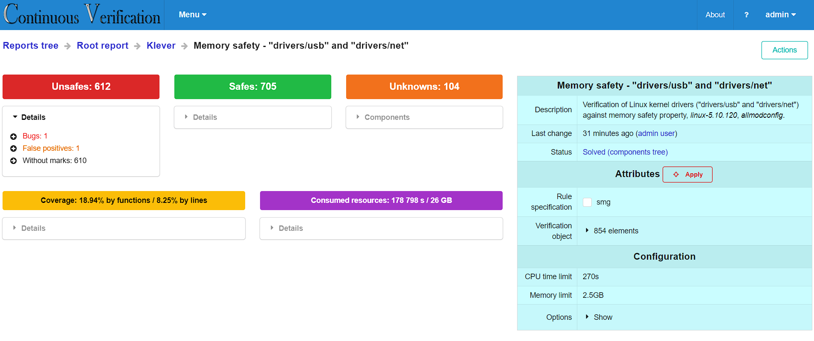
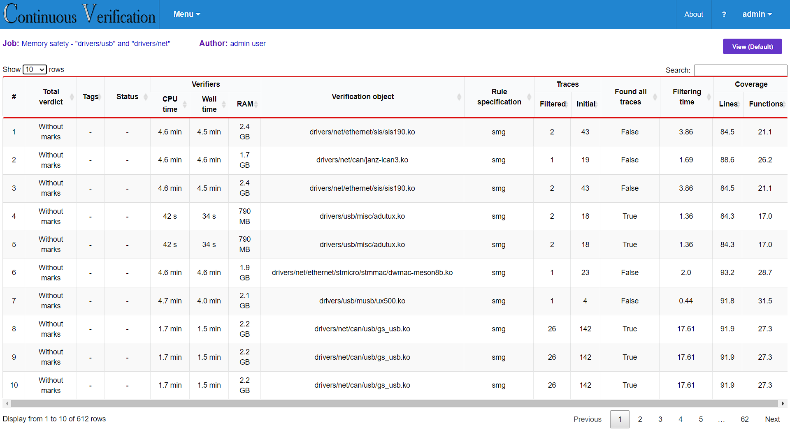
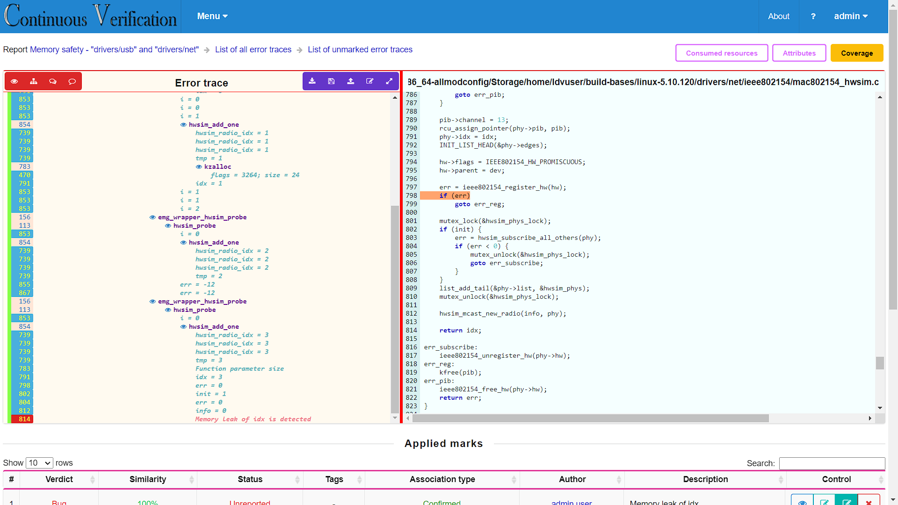
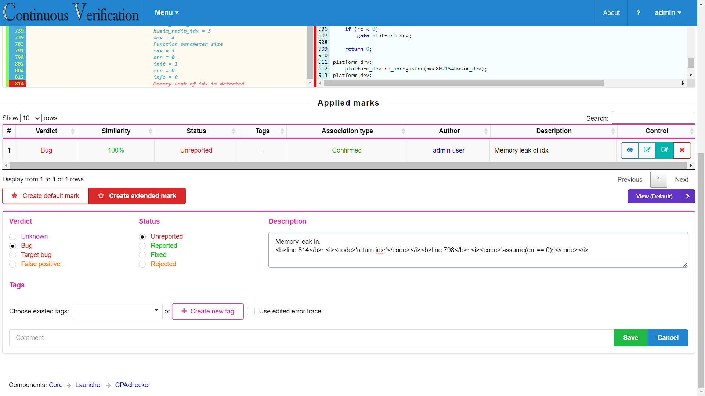
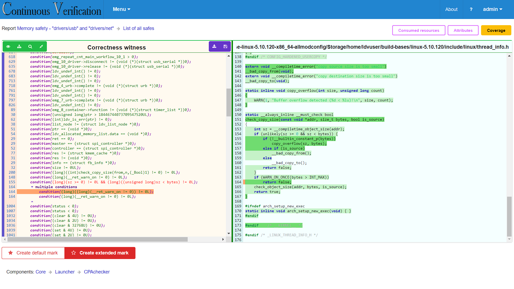
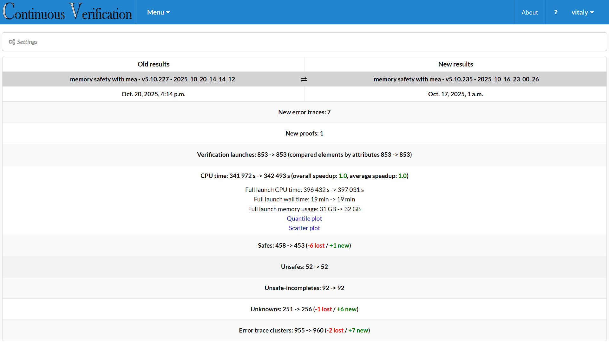

# Continuous Verification Visualizer (CVV)

[](https://www.apache.org/licenses/LICENSE-2.0)

**Continuous Verification Visualizer (CVV)** is a web-based interface for visualizing software verification results, with built-in support for regression verification workflows.

---

## Definitions

* A **verification task** is a program associated with a specific entry point and a property to be checked.
  For example, verifying a C source file for the *memory safety* property, which ensures correct usage of memory allocation and deallocation.

* A **verification tool** is a software verifier that solves a given verification task and produces a **verification result**.
  The result is typically provided in a machine-readable format.

* A **verification result** may contain:

  * a **correctness witness** -- a proof that the property cannot be violated in the given program, or
  * one or more **error traces** -- execution paths from the program’s entry point to a property violation, or
  * a report on **abnormal verifier termination** (for example, due to resource exhaustion).

---

## Overview

CVV visualizes sets of verification results in a human-readable and interactive format.
These results are typically grouped by a common criterion -- for example, the verification outcomes for a new version of an operating system.

CVV provides the following capabilities:

* Visualization of **error traces** with interactive links to the corresponding source code.
* Display of **correctness witnesses**, including invariants and conditions that ensure the verified property cannot be violated.
* Inspection of **verifier logs** in cases of abnormal termination.
* Visualization of **code coverage** data obtained during verification.
* Presentation of **resource usage statistics** (e.g., CPU time, memory consumption, I/O operations).
* **Comparison of verification results** across versions or configurations to highlight differences.

---

## Preparing Verification Tasks

To prepare and execute verification tasks, you can use one of the following frameworks:

* [**Continuous Verification (CV)**](https://github.com/ispras/cv) -- for generic software projects.
* [**Klever**](https://github.com/ldv-klever/klever) -- for the verification of Linux kernel modules.

---

## Requirements

- **Operating system:** Ubuntu 20.04 or later  
- **Dependencies:** Installed automatically via the provided Dockerfile

If you prefer manual installation, make sure the following packages are available:

```bash
sudo apt update
sudo apt install -y \
    software-properties-common \
    build-essential \
    git \
    python3-dev \
    python3-pip \
    python3-setuptools \
    python3-wheel \
    gettext \
    postgresql \
    libpq-dev \
    graphviz
````

Then install Python dependencies:

```bash
pip3 install --upgrade pip
pip3 install "setuptools<66.0.0"
pip3 install \
    requests \
    ujson \
    django==4.2 \
    pluggy \
    py \
    attrs \
    six \
    more-itertools \
    ply \
    pytest \
    atomicwrites \
    pycparser \
    psycopg2-binary \
    sympy \
    pytz
```

---

## Installation and Deployment

### Option 1: Using Docker

1. Build the image:

   ```bash
   docker build -t cv .
   ```

2. Run the container:

   ```bash
   docker run -d -p 8989:8989 --name cv cv
   ```

   This automatically installs and deploys the Continuous Verification Visualizer.

3. Once the container is running, open your browser and navigate to:

   ```
   http://<your-machine-ip>:8989
   ```

   Log in with the default credentials (`admin/admin`).
   You can later change them in the **Settings** panel.

---

### Option 2: Manual deployment

1. Initialize the database and create a default user (`admin/admin`):

   ```bash
   deploys/deployment.sh <database_name>
   ```

2. Start the CV web server:
   ```bash
   nohup ./start.sh --host <host> --port <port> &
   ```

3. After startup, open a browser and navigate to:

   ```
   http://<host>:<port>
   ```

   Log in and proceed with configuration:

   * Create or modify user accounts via **Admin tools**.
   * Organize the reports tree if needed.
   * Upload verification results.

4. To stop the background server:

   ```bash
   ./stop.sh
   ```

---

## Web Interface Usage

### Main Page

The main page displays a collection of verification results:


From this view, you can navigate to list of **error traces**
(`Unsafes: ...`), **correctness proofs** (`Safes: ...`),
**verifier logs** of abnormal termination (`Unknowns: ...`),
as well as **code coverage** statistics and detailed **resource usage** information.

---

### Unsafes Page

The *Unsafes* page lists all **error traces**, representing potential bugs detected during verification:


Each entry can be filtered and distinguished by various attributes, such as module name, property type.

---

### Unsafe Page

Each **error trace** shows a path through the source code leading to a potential property violation:


Users can navigate through the trace interactively by expanding or collapsing individual elements to focus on the relevant steps.

---

### Mark Creation

During analysis, the user determines whether the reported trace corresponds to a **real bug** or a **false positive**.
Once this decision is made, a *mark* can be created, which will automatically apply to all similar error traces in the future:


When verifying new software versions, such marks help to:

* Skip already known false positives, and
* Check whether previously identified bugs have been fixed.

---

### Safe Page

Each **correctness witness** displays the essential proof elements, such as **conditions** and **invariants**:


The page also includes **code coverage** information, highlighting parts of the program that were not analyzed during verification.

### Regression Verification Support

CVV supports **regression verification**, allowing users to compare verification results across different software versions or tool runs:



The comparison view highlights:

* New error traces and new proofs introduced in the latest version,
* transitions in verification results (e.g., from `Safe` to `Unsafe`), and
* changes in resource consumption.

This helps users quickly focus on the most relevant differences between verification runs and track the evolution of verification quality over time.
